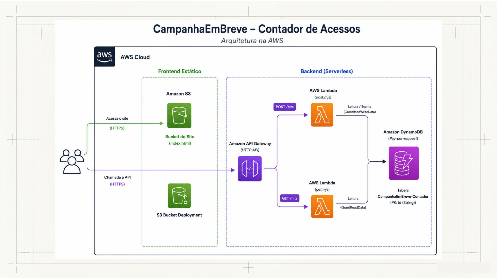

# Contador de acessos com AWS

Projeto full stack para contar acessos em um site estático usando AWS. A aplicação expõe uma interface em React/Vite e uma camada serverless com AWS Lambda, API Gateway, DynamoDB e S3, formando uma arquitetura simples, escalável e de baixo custo para landing pages, campanhas e páginas institucionais.



## Visão geral

O fluxo do sistema é o seguinte:

1. O navegador carrega o site estático hospedado em um bucket S3.
2. O frontend consulta a API HTTP do Amazon API Gateway.
3. A rota `GET /hits` lê o total de acessos gravado no DynamoDB.
4. A rota `POST /hits` incrementa o contador e retorna o valor atualizado.
5. O React renderiza o total na interface.

O estado do contador é persistido em uma tabela DynamoDB com chave primária fixa, o que simplifica a lógica e mantém a solução compatível com uma arquitetura serverless.

## Arquitetura

- Frontend: React 19, TypeScript e Vite.
- Infraestrutura: AWS CDK em TypeScript.
- API: Amazon API Gateway HTTP API.
- Computação: AWS Lambda.
- Persistência: Amazon DynamoDB.
- Hospedagem do site: Amazon S3 com website hosting.
- Deploy do frontend: AWS S3 Bucket Deployment via CDK.

## Funcionalidades

- Contabilização de acessos em tempo real.
- Leitura do total atual sem necessidade de backend tradicional.
- Persistência do contador entre deploys.
- Separação clara entre infraestrutura e interface.
- CORS configurado para consumo direto pelo frontend.

## Estrutura do repositório

- `frontend-site/`: aplicação React responsável pela interface pública.
- `backend-infra/`: stack AWS CDK, Lambdas, testes e definição dos recursos.
- `backend-infra/lambda/`: funções `GET` e `POST` que operam sobre o DynamoDB.

## Implementação técnica

### Frontend

O frontend foi construído com React e Vite, com tipagem TypeScript. A aplicação exibe uma landing page institucional e busca o total de acessos na inicialização. Quando necessário, a rota de incremento é chamada para registrar novas visitas.

### Backend serverless

O backend é composto por duas funções Lambda:

- `GET /hits`: lê o valor atual do contador.
- `POST /hits`: incrementa o valor de forma atômica no DynamoDB.

As duas funções usam a variável de ambiente `TABLE_NAME`, injetada pelo CDK, para evitar acoplamento com nomes fixos de recursos no código.

### Infraestrutura como código

A stack em CDK provisiona:

- Uma tabela DynamoDB chamada `CampanhaEmBreve-Contador`.
- Duas Lambdas Node.js 20.
- Um HTTP API com permissões de CORS.
- Um bucket S3 público para o site estático.
- Um deployment automatizado do build do frontend para o bucket.

## Como executar localmente

Pré-requisitos:

- Node.js 20 ou superior.
- AWS CLI configurado, caso queira implantar na conta AWS.
- AWS CDK instalado globalmente ou disponível via `npx`.

### Frontend

```bash
cd frontend-site
npm install
npm run dev
```

Para gerar o build de produção:

```bash
cd frontend-site
npm run build
```

### Infraestrutura

```bash
cd backend-infra
npm install
npm run build
```

## Deploy na AWS

1. Gere o build do frontend com `npm run build` dentro de `frontend-site`.
2. Verifique se a pasta `frontend-site/dist` foi criada, pois ela é usada pelo CDK no deployment do site.
3. Compile a infraestrutura em `backend-infra` com `npm run build`.
4. Synthesize e faça deploy da stack com o CDK.

Exemplo:

```bash
cd backend-infra
npx cdk synth
npx cdk deploy
```

Após o deploy, a stack publica dois outputs principais:

- `ApiUrl`: endpoint HTTP da aplicação.
- `WebsiteUrl`: URL pública do site estático.

## Configuração do frontend

O frontend consome a URL da API diretamente no código da aplicação. Após publicar a stack, ajuste a constante `API_URL` em `frontend-site/src/App.tsx` para apontar para o valor exposto no output `ApiUrl`.

## Modelo de dados

A tabela DynamoDB utiliza uma chave primária `id` com um item fixo para o contador. O atributo `count` armazena o total acumulado de acessos.

## Decisões de projeto

- Arquitetura serverless para reduzir custo operacional e esforço de manutenção.
- Persistência simples em DynamoDB para otimizar leitura e escrita do contador.
- Frontend estático desacoplado do backend para facilitar distribuição via CDN ou S3.
- Stack em CDK para permitir revisão, reprodutibilidade e versionamento da infraestrutura.
